# Architecture diagrams

The diagrams of AI Pair, rendered by GitHub from the bundle in
[.archi/ai-pair.json](.archi/ai-pair.json). The same bundle, with the notes and
guided tour, is in the [interactive version](docs/ai-pair.html). The prose is in
[ARCHITECTURE.md](ARCHITECTURE.md).

## Overview

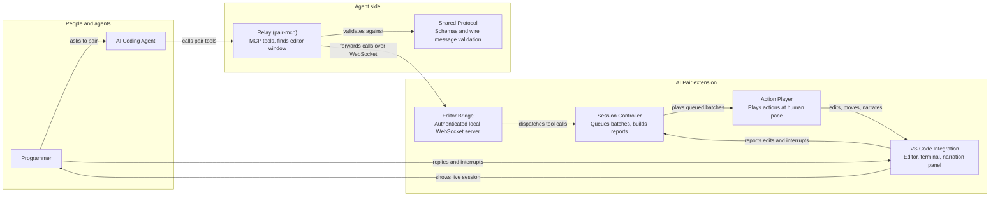
```mermaid
%%{init: {"flowchart": {"curve": "basis"}}}%%
flowchart LR
  subgraph people["People and agents"]
    programmer["Programmer"]
    agent["AI Coding Agent"]
  end
  subgraph agentside["Agent side"]
    relay["Relay (pair-mcp)
MCP tools, finds editor window"]
    protocol["Shared Protocol
Schemas and wire message validation"]
  end
  subgraph extension["AI Pair extension"]
    bridge["Editor Bridge
Authenticated local WebSocket server"]
    controller["Session Controller
Queues batches, builds reports"]
    player["Action Player
Plays actions at human pace"]
    vscode["VS Code Integration
Editor, terminal, narration panel"]
  end
  programmer -->|"asks to pair"| agent
  agent -->|"calls pair tools"| relay
  relay -->|"validates against"| protocol
  relay -->|"forwards calls over WebSocket"| bridge
  bridge -->|"dispatches tool calls"| controller
  controller -->|"plays queued batches"| player
  player -->|"edits, moves, narrates"| vscode
  vscode -->|"shows live session"| programmer
  programmer -->|"replies and interrupts"| vscode
  vscode -->|"reports edits and interrupts"| controller
```

## Architecture

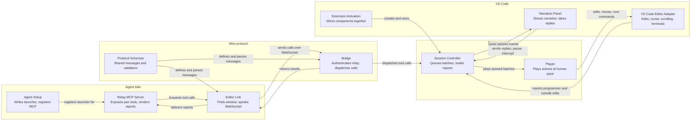
```mermaid
%%{init: {"flowchart": {"curve": "basis"}}}%%
flowchart LR
  subgraph agent["Agent side"]
    relay["Relay MCP Server
Exposes pair tools, renders reports"]
    n_link["Editor Link
Finds window, speaks WebSocket"]
    setup["Agent Setup
Writes launcher, registers MCP"]
  end
  subgraph wire["Wire protocol"]
    protocol["Protocol Schemas
Shared messages and validators"]
    bridge["Bridge
Authenticates relay, dispatches calls"]
  end
  subgraph session["Pairing session"]
    controller["Session Controller
Queues batches, builds reports"]
    player["Player
Plays actions at human pace"]
  end
  subgraph ide["VS Code"]
    editor["VS Code Editor Adapter
Edits, cursor, scrolling, terminals"]
    panel["Narration Panel
Shows narration, takes replies"]
    ext["Extension Activation
Wires components together"]
  end
  setup -->|"registers launcher for"| relay
  relay -->|"forwards tool calls"| n_link
  n_link -->|"sends calls over WebSocket"| bridge
  bridge -->|"returns results"| n_link
  n_link -->|"delivers reports"| relay
  protocol -->|"defines and parses messages"| bridge
  protocol -->|"defines and parses messages"| n_link
  bridge -->|"dispatches tool calls"| controller
  controller -->|"plays queued batches"| player
  player -->|"edits, moves, runs commands"| editor
  controller -->|"posts session events"| panel
  editor -->|"reports programmer and outside edits"| controller
  panel -->|"sends replies, pause, interrupt"| controller
  ext -->|"creates and wires"| controller
```

## Session Start and Resume

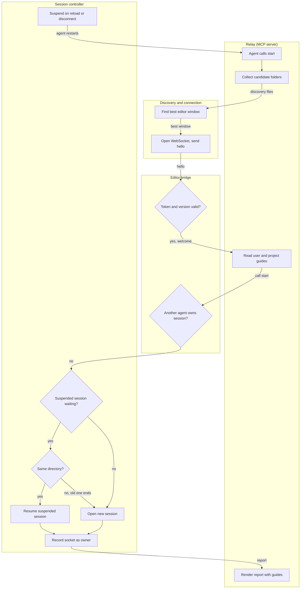
```mermaid
%%{init: {"flowchart": {"curve": "basis"}}}%%
flowchart TD
  subgraph relay["Relay (MCP server)"]
    n_call["Agent calls start"]
    folders["Collect candidate folders"]
    guides["Read user and project guides"]
    render["Render report with guides"]
  end
  subgraph n_link["Discovery and connection"]
    find["Find best editor window"]
    conn["Open WebSocket, send hello"]
  end
  subgraph editor["Editor bridge"]
    auth{"Token and version valid?"}
    dispatch{"Another agent owns session?"}
  end
  subgraph session["Session controller"]
    susp{"Suspended session waiting?"}
    same{"Same directory?"}
    resume["Resume suspended session"]
    fresh["Open new session"]
    own["Record socket as owner"]
    suspend["Suspend on reload or disconnect"]
  end
  n_call --> folders
  folders -->|"discovery files"| find
  find -->|"best window"| conn
  conn -->|"hello"| auth
  auth -->|"yes, welcome"| guides
  guides -->|"call start"| dispatch
  dispatch -->|"no"| susp
  susp -->|"yes"| same
  susp -->|"no"| fresh
  same -->|"yes"| resume
  same -->|"no, old one ends"| fresh
  resume --> own
  fresh --> own
  own -->|"report"| render
  suspend -->|"agent restarts"| n_call
```

## Batch Rehearsal and Playback

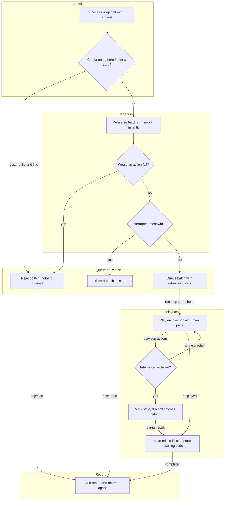
```mermaid
%%{init: {"flowchart": {"curve": "basis"}}}%%
flowchart TD
  subgraph submit["Submit"]
    recv["Receive step call with actions"]
    anchor{"Cursor unanchored after a stop?"}
  end
  subgraph rehearse_grp["Rehearse"]
    rehearse["Rehearse batch in memory, instantly"]
    failed{"Would an action fail?"}
    stale{"Interrupted meanwhile?"}
  end
  subgraph queue_grp["Queue or Refuse"]
    reject["Reject batch, nothing queued"]
    discard["Discard batch as stale"]
    queue["Queue batch with rehearsed state"]
  end
  subgraph play["Playback"]
    perform["Play each action at human pace"]
    interrupted{"Interrupted or failed?"}
    finish["Save edited files, capture resulting code"]
    stop["Mark stale, discard batches behind"]
  end
  subgraph report_grp["Report"]
    report["Build report and return to agent"]
  end
  recv --> anchor
  anchor -->|"yes, no file and line"| reject
  anchor -->|"no"| rehearse
  rehearse --> failed
  failed -->|"yes"| reject
  failed -->|"no"| stale
  stale -->|"yes"| discard
  stale -->|"no"| queue
  queue -->|"run loop starts head"| perform
  perform -->|"between actions"| interrupted
  interrupted -->|"no, next action"| perform
  interrupted -->|"yes"| stop
  perform -->|"all played"| finish
  finish -->|"completed"| report
  stop -->|"partial result"| finish
  reject -->|"rejected"| report
  discard -->|"discarded"| report
```

## Interruption and Turn Handling

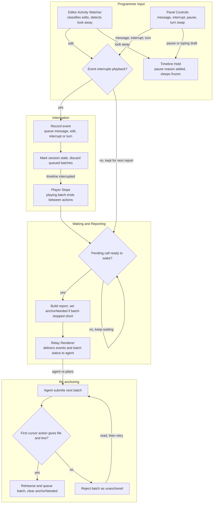
```mermaid
%%{init: {"flowchart": {"curve": "basis"}}}%%
flowchart TD
  subgraph input["Programmer Input"]
    watch["Editor Activity Watcher
classifies edits, detects look-away"]
    panel["Panel Controls
message, interrupt, pause, turn swap"]
    interrupting{"Event interrupts playback?"}
    hold["Timeline Hold
pause reason added, sleeps frozen"]
  end
  subgraph interrupt["Interruption"]
    record["Record event
queue message, edit, interrupt or turn"]
    stale["Mark session stale, discard queued batches"]
    stop["Player Stops
playing batch ends between actions"]
  end
  subgraph report_grp["Waking and Reporting"]
    ready{"Pending call ready to wake?"}
    report["Build report, set anchorNeeded if batch stopped short"]
    deliver["Relay Renderer
delivers events and batch status to agent"]
  end
  subgraph anchor["Re-anchoring"]
    submit["Agent submits next batch"]
    anchored{"First cursor action gives file and line?"}
    refuse["Reject batch as unanchored"]
    queue["Rehearse and queue batch, clear anchorNeeded"]
  end
  watch -->|"edit"| interrupting
  panel -->|"message, interrupt, turn"| interrupting
  watch -->|"look away"| hold
  panel -->|"pause or typing draft"| hold
  interrupting -->|"yes"| record
  interrupting -->|"no, kept for next report"| ready
  record --> stale
  stale -->|"timeline interrupted"| stop
  stop --> ready
  ready -->|"yes"| report
  ready -->|"no, keep waiting"| ready
  report --> deliver
  deliver -->|"agent re-plans"| submit
  submit --> anchored
  anchored -->|"yes"| queue
  anchored -->|"no"| refuse
  refuse -->|"read, then retry"| submit
```

## Command Run Confirmation

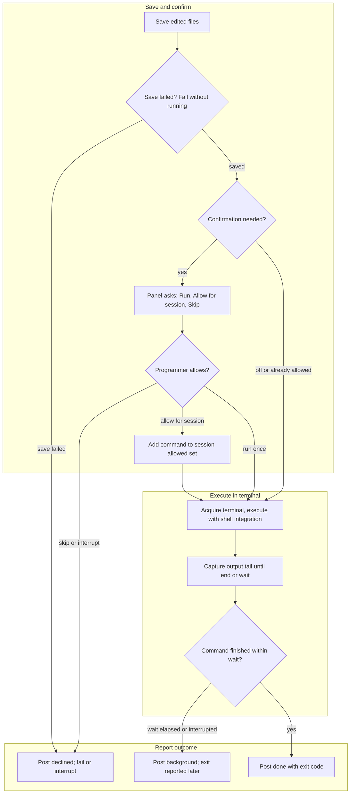
```mermaid
%%{init: {"flowchart": {"curve": "basis"}}}%%
flowchart TD
  subgraph confirm["Save and confirm"]
    save["Save edited files"]
    failsave{"Save failed? Fail without running"}
    need{"Confirmation needed?"}
    ask["Panel asks: Run, Allow for session, Skip"]
    decide{"Programmer allows?"}
    remember["Add command to session allowed set"]
  end
  subgraph execute["Execute in terminal"]
    exec["Acquire terminal, execute with shell integration"]
    capture["Capture output tail until end or wait"]
    ended{"Command finished within wait?"}
  end
  subgraph report["Report outcome"]
    declined["Post declined; fail or interrupt"]
    bg["Post background; exit reported later"]
    done["Post done with exit code"]
  end
  save --> failsave
  failsave -->|"saved"| need
  need -->|"yes"| ask
  need -->|"off or already allowed"| exec
  ask --> decide
  decide -->|"allow for session"| remember
  decide -->|"run once"| exec
  decide -->|"skip or interrupt"| declined
  remember --> exec
  exec --> capture
  capture --> ended
  ended -->|"yes"| done
  ended -->|"wait elapsed or interrupted"| bg
  failsave -->|"save failed"| declined
```

## Outside Change Tracking

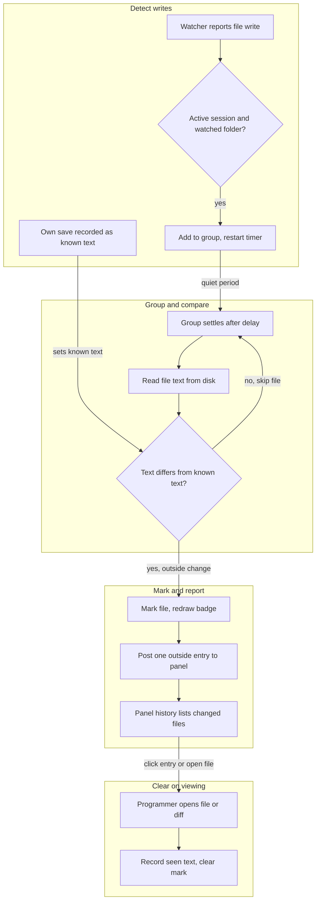
```mermaid
%%{init: {"flowchart": {"curve": "basis"}}}%%
flowchart TD
  subgraph detect["Detect writes"]
    w["Watcher reports file write"]
    f{"Active session and watched folder?"}
    g["Add to group, restart timer"]
    s["Own save recorded as known text"]
  end
  subgraph compare["Group and compare"]
    t["Group settles after delay"]
    r["Read file text from disk"]
    d{"Text differs from known text?"}
  end
  subgraph mark["Mark and report"]
    m["Mark file, redraw badge"]
    h["Post one outside entry to panel"]
    p["Panel history lists changed files"]
  end
  subgraph clear["Clear on viewing"]
    o["Programmer opens file or diff"]
    c["Record seen text, clear mark"]
  end
  w --> f
  f -->|"yes"| g
  g -->|"quiet period"| t
  s -->|"sets known text"| d
  t --> r
  r --> d
  d -->|"yes, outside change"| m
  d -->|"no, skip file"| t
  m --> h
  h --> p
  p -->|"click entry or open file"| o
  o --> c
```

## Agent Setup and Reading Calibration

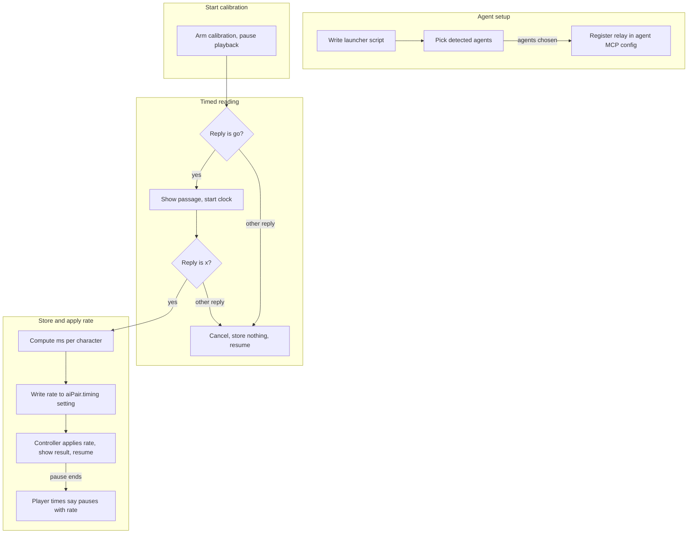
```mermaid
%%{init: {"flowchart": {"curve": "basis"}}}%%
flowchart TD
  subgraph setup["Agent setup"]
    launcher["Write launcher script"]
    pick["Pick detected agents"]
    register["Register relay in agent MCP config"]
  end
  subgraph arm_grp["Start calibration"]
    arm["Arm calibration, pause playback"]
  end
  subgraph timing["Timed reading"]
    go{"Reply is go?"}
    read["Show passage, start clock"]
    stop{"Reply is x?"}
    cancel["Cancel, store nothing, resume"]
  end
  subgraph store_grp["Store and apply rate"]
    finish["Compute ms per character"]
    store["Write rate to aiPair.timing setting"]
    apply["Controller applies rate, show result, resume"]
    use["Player times say pauses with rate"]
  end
  launcher --> pick
  pick -->|"agents chosen"| register
  arm --> go
  go -->|"yes"| read
  go -->|"other reply"| cancel
  read --> stop
  stop -->|"yes"| finish
  stop -->|"other reply"| cancel
  finish --> store
  store --> apply
  apply -->|"pause ends"| use
```

## Session Startup and Window Discovery

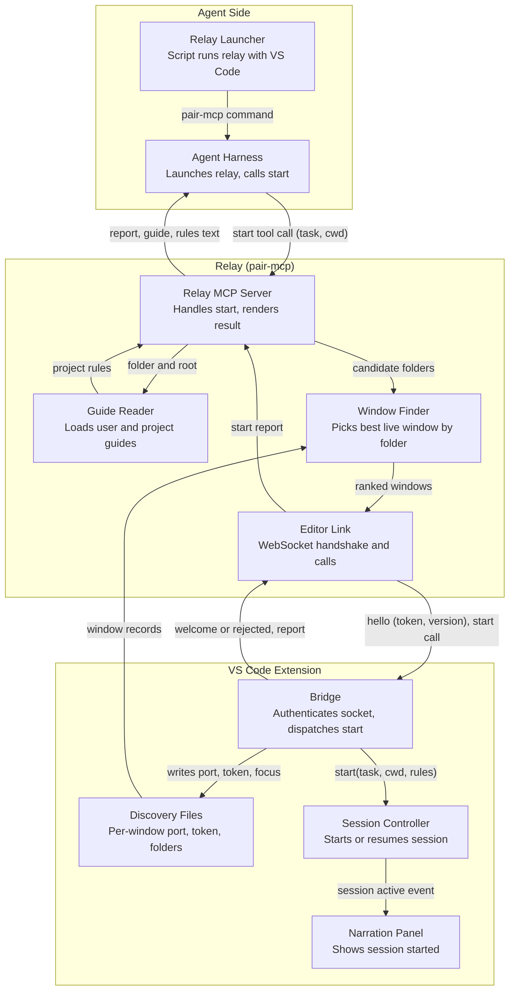
```mermaid
%%{init: {"flowchart": {"curve": "basis"}}}%%
flowchart TD
  subgraph agent["Agent Side"]
    harness["Agent Harness
Launches relay, calls start"]
    launcher["Relay Launcher
Script runs relay with VS Code"]
  end
  subgraph relay["Relay (pair-mcp)"]
    mcp["Relay MCP Server
Handles start, renders result"]
    guides["Guide Reader
Loads user and project guides"]
    finder["Window Finder
Picks best live window by folder"]
    n_link["Editor Link
WebSocket handshake and calls"]
  end
  subgraph editor["VS Code Extension"]
    disc["Discovery Files
Per-window port, token, folders"]
    bridge["Bridge
Authenticates socket, dispatches start"]
    controller["Session Controller
Starts or resumes session"]
    panel["Narration Panel
Shows session started"]
  end
  launcher -->|"pair-mcp command"| harness
  harness -->|"start tool call (task, cwd)"| mcp
  mcp -->|"candidate folders"| finder
  disc -->|"window records"| finder
  mcp -->|"folder and root"| guides
  guides -->|"project rules"| mcp
  finder -->|"ranked windows"| n_link
  n_link -->|"hello (token, version), start call"| bridge
  bridge -->|"welcome or rejected, report"| n_link
  bridge -->|"writes port, token, focus"| disc
  bridge -->|"start(task, cwd, rules)"| controller
  controller -->|"session active event"| panel
  n_link -->|"start report"| mcp
  mcp -->|"report, guide, rules text"| harness
```

## Agent Batch Playback

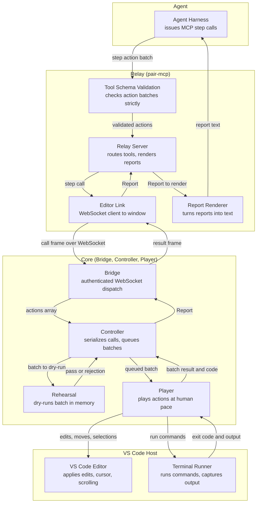
```mermaid
%%{init: {"flowchart": {"curve": "basis"}}}%%
flowchart TD
  subgraph agent_grp["Agent"]
    agent["Agent Harness
issues MCP step calls"]
  end
  subgraph relay_grp["Relay (pair-mcp)"]
    schema["Tool Schema Validation
checks action batches strictly"]
    relay["Relay Server
routes tools, renders reports"]
    n_link["Editor Link
WebSocket client to window"]
    render["Report Renderer
turns reports into text"]
  end
  subgraph core["Core (Bridge, Controller, Player)"]
    bridge["Bridge
authenticated WebSocket dispatch"]
    ctrl["Controller
serializes calls, queues batches"]
    rehearse["Rehearsal
dry-runs batch in memory"]
    player["Player
plays actions at human pace"]
  end
  subgraph host["VS Code Host"]
    editor["VS Code Editor
applies edits, cursor, scrolling"]
    term["Terminal Runner
runs commands, captures output"]
  end
  agent -->|"step action batch"| schema
  schema -->|"validated actions"| relay
  relay -->|"step call"| n_link
  n_link -->|"call frame over WebSocket"| bridge
  bridge -->|"actions array"| ctrl
  ctrl -->|"batch to dry-run"| rehearse
  rehearse -->|"pass or rejection"| ctrl
  ctrl -->|"queued batch"| player
  player -->|"edits, moves, selections"| editor
  player -->|"run commands"| term
  term -->|"exit code and output"| player
  player -->|"batch result and code"| ctrl
  ctrl -->|"Report"| bridge
  bridge -->|"result frame"| n_link
  n_link -->|"Report"| relay
  relay -->|"Report to render"| render
  render -->|"report text"| agent
```

## Command Run and Terminal Output

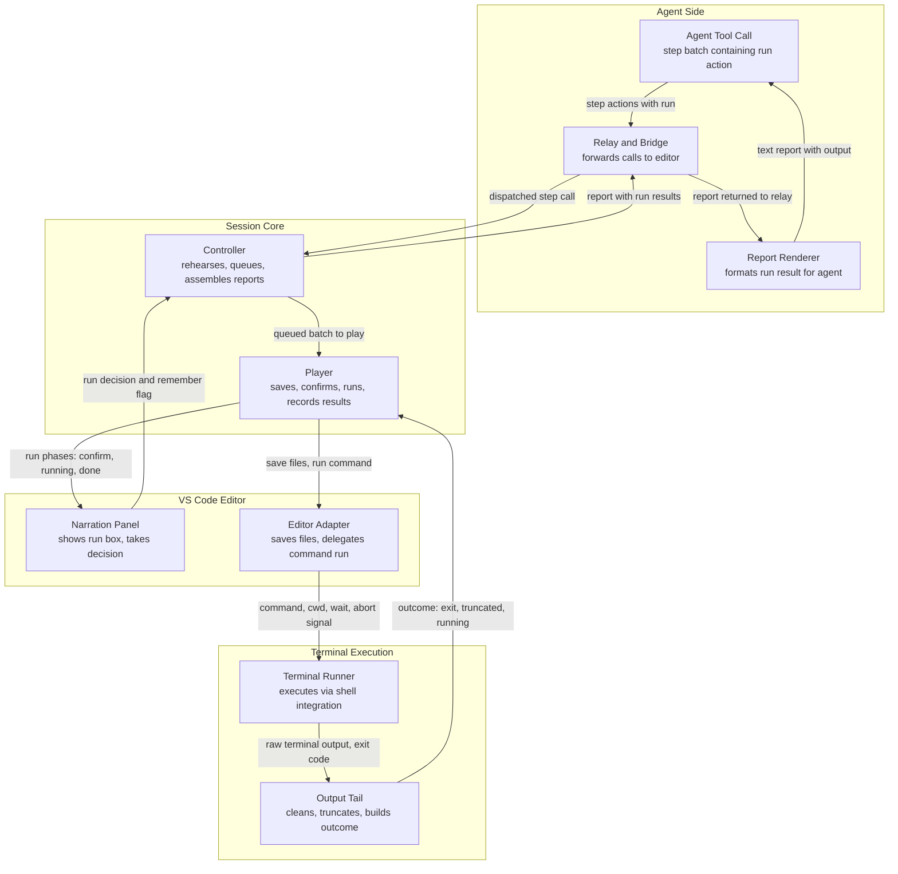
```mermaid
%%{init: {"flowchart": {"curve": "basis"}}}%%
flowchart TD
  subgraph entry["Agent Side"]
    agent["Agent Tool Call
step batch containing run action"]
    n_link["Relay and Bridge
forwards calls to editor"]
    render["Report Renderer
formats run result for agent"]
  end
  subgraph core["Session Core"]
    ctrl["Controller
rehearses, queues, assembles reports"]
    player["Player
saves, confirms, runs, records results"]
  end
  subgraph editor_grp["VS Code Editor"]
    panel["Narration Panel
shows run box, takes decision"]
    editor["Editor Adapter
saves files, delegates command run"]
  end
  subgraph terminal["Terminal Execution"]
    term["Terminal Runner
executes via shell integration"]
    tail["Output Tail
cleans, truncates, builds outcome"]
  end
  agent -->|"step actions with run"| n_link
  n_link -->|"dispatched step call"| ctrl
  ctrl -->|"queued batch to play"| player
  player -->|"save files, run command"| editor
  player -->|"run phases: confirm, running, done"| panel
  panel -->|"run decision and remember flag"| ctrl
  editor -->|"command, cwd, wait, abort signal"| term
  term -->|"raw terminal output, exit code"| tail
  tail -->|"outcome: exit, truncated, running"| player
  ctrl -->|"report with run results"| n_link
  n_link -->|"report returned to relay"| render
  render -->|"text report with output"| agent
```

## Session Persistence and Outside Changes

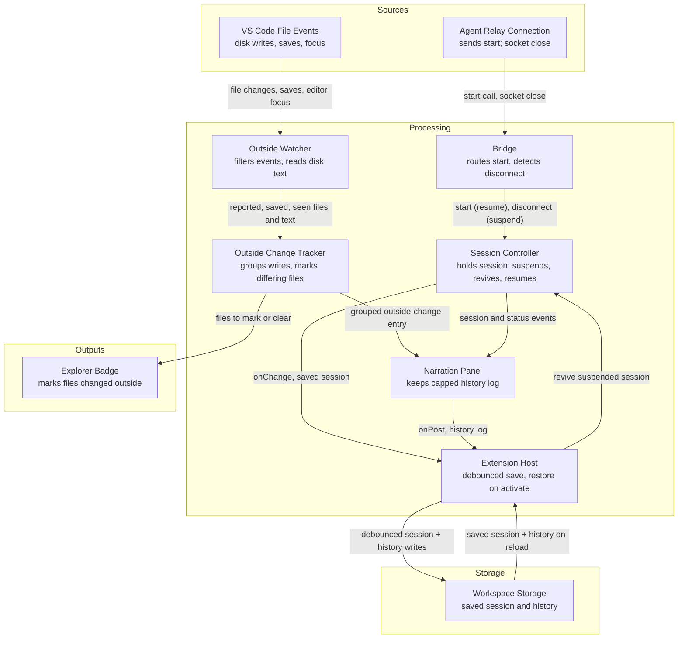
```mermaid
%%{init: {"flowchart": {"curve": "basis"}}}%%
flowchart TD
  subgraph sources["Sources"]
    relay["Agent Relay Connection
sends start; socket close"]
    fsevents["VS Code File Events
disk writes, saves, focus"]
  end
  subgraph processing["Processing"]
    bridge["Bridge
routes start, detects disconnect"]
    watcher["Outside Watcher
filters events, reads disk text"]
    tracker["Outside Change Tracker
groups writes, marks differing files"]
    controller["Session Controller
holds session; suspends, revives, resumes"]
    panel["Narration Panel
keeps capped history log"]
    ext["Extension Host
debounced save, restore on activate"]
  end
  subgraph stores["Storage"]
    storage["Workspace Storage
saved session and history"]
  end
  subgraph outputs["Outputs"]
    badge["Explorer Badge
marks files changed outside"]
  end
  relay -->|"start call, socket close"| bridge
  bridge -->|"start (resume), disconnect (suspend)"| controller
  fsevents -->|"file changes, saves, editor focus"| watcher
  watcher -->|"reported, saved, seen files and text"| tracker
  tracker -->|"files to mark or clear"| badge
  tracker -->|"grouped outside-change entry"| panel
  controller -->|"session and status events"| panel
  controller -->|"onChange, saved session"| ext
  panel -->|"onPost, history log"| ext
  ext -->|"debounced session + history writes"| storage
  storage -->|"saved session + history on reload"| ext
  ext -->|"revive suspended session"| controller
```

## Reading Speed Calibration

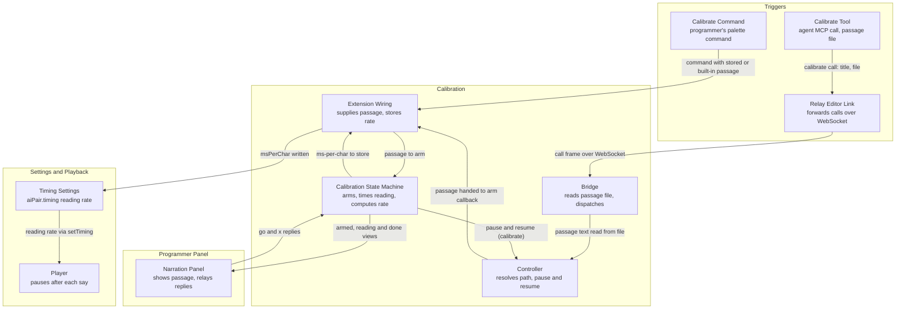
```mermaid
%%{init: {"flowchart": {"curve": "basis"}}}%%
flowchart TD
  subgraph triggers["Triggers"]
    cmd["Calibrate Command
programmer's palette command"]
    tool["Calibrate Tool
agent MCP call, passage file"]
    n_link["Relay Editor Link
forwards calls over WebSocket"]
  end
  subgraph calibration["Calibration"]
    bridge["Bridge
reads passage file, dispatches"]
    ctrl["Controller
resolves path, pause and resume"]
    calib["Calibration State Machine
arms, times reading, computes rate"]
    wiring["Extension Wiring
supplies passage, stores rate"]
  end
  subgraph ui["Programmer Panel"]
    panel["Narration Panel
shows passage, relays replies"]
  end
  subgraph storage["Settings and Playback"]
    settings["Timing Settings
aiPair.timing reading rate"]
    player["Player
pauses after each say"]
  end
  tool -->|"calibrate call: title, file"| n_link
  n_link -->|"call frame over WebSocket"| bridge
  bridge -->|"passage text read from file"| ctrl
  ctrl -->|"passage handed to arm callback"| wiring
  cmd -->|"command with stored or built-in passage"| wiring
  wiring -->|"passage to arm"| calib
  calib -->|"pause and resume (calibrate)"| ctrl
  calib -->|"armed, reading and done views"| panel
  panel -->|"go and x replies"| calib
  calib -->|"ms-per-char to store"| wiring
  wiring -->|"msPerChar written"| settings
  settings -->|"reading rate via setTiming"| player
```

## Pairing Session Lifecycle

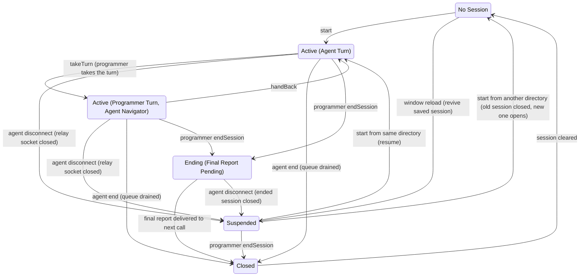
```mermaid
stateDiagram-v2
  state "No Session" as none
  state "Active (Agent Turn)" as agentTurn
  state "Active (Programmer Turn, Agent Navigator)" as navigator
  state "Suspended" as suspended
  state "Ending (Final Report Pending)" as ending
  state "Closed" as closed
  none --> agentTurn: start
  agentTurn --> navigator: takeTurn (programmer takes the turn)
  navigator --> agentTurn: handBack
  agentTurn --> suspended: agent disconnect (relay socket closed)
  navigator --> suspended: agent disconnect (relay socket closed)
  none --> suspended: window reload (revive saved session)
  suspended --> agentTurn: start from same directory (resume)
  suspended --> none: start from another directory (old session closed, new one opens)
  suspended --> closed: programmer endSession
  agentTurn --> closed: agent end (queue drained)
  navigator --> closed: agent end (queue drained)
  agentTurn --> ending: programmer endSession
  navigator --> ending: programmer endSession
  ending --> closed: final report delivered to next call
  ending --> suspended: agent disconnect (ended session closed)
  closed --> none: session cleared
```

## Batch Queue and Playback

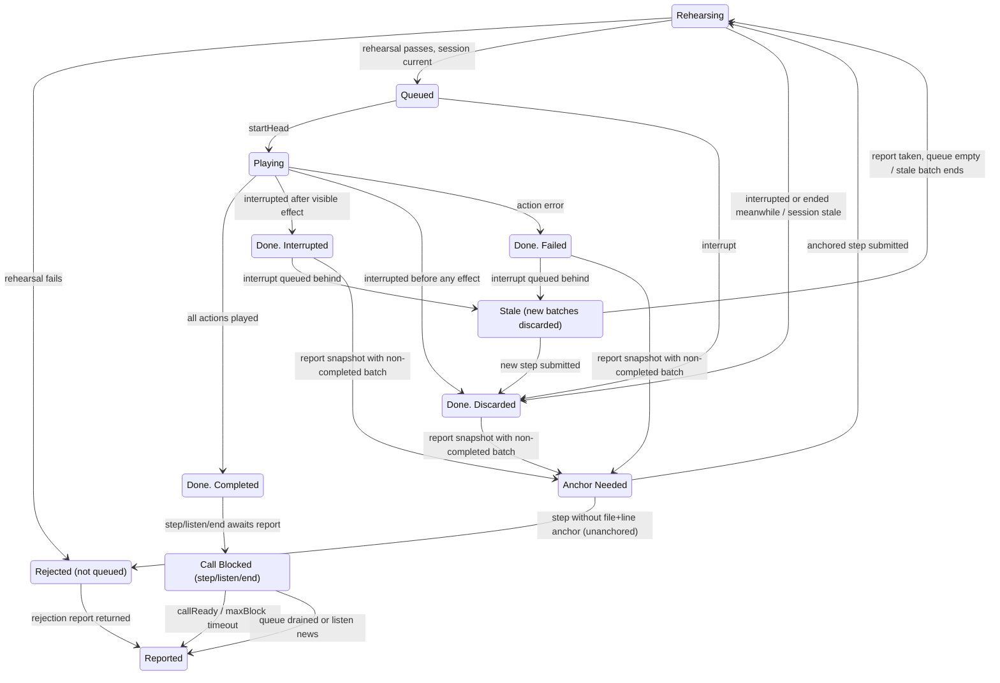
```mermaid
stateDiagram-v2
  state "Rehearsing" as rehearsing
  state "Rejected (not queued)" as rejected
  state "Queued" as queued
  state "Playing" as playing
  state "Done. Completed" as completed
  state "Done. Interrupted" as interrupted
  state "Done. Failed" as failed
  state "Done. Discarded" as discarded
  state "Stale (new batches discarded)" as stale
  state "Anchor Needed" as anchorneeded
  state "Call Blocked (step/listen/end)" as blocked
  state "Reported" as reported
  rehearsing --> rejected: rehearsal fails
  rehearsing --> queued: rehearsal passes, session current
  rehearsing --> discarded: interrupted or ended meanwhile / session stale
  queued --> playing: startHead
  queued --> discarded: interrupt
  playing --> completed: all actions played
  playing --> interrupted: interrupted after visible effect
  playing --> discarded: interrupted before any effect
  playing --> failed: action error
  interrupted --> stale: interrupt queued behind
  failed --> stale: interrupt queued behind
  stale --> discarded: new step submitted
  stale --> rehearsing: report taken, queue empty / stale batch ends
  completed --> blocked: step/listen/end awaits report
  interrupted --> anchorneeded: report snapshot with non-completed batch
  failed --> anchorneeded: report snapshot with non-completed batch
  discarded --> anchorneeded: report snapshot with non-completed batch
  anchorneeded --> rejected: step without file+line anchor (unanchored)
  anchorneeded --> rehearsing: anchored step submitted
  blocked --> reported: callReady / maxBlock timeout
  blocked --> reported: queue drained or listen news
  rejected --> reported: rejection report returned
```

## Agent Status and Pause

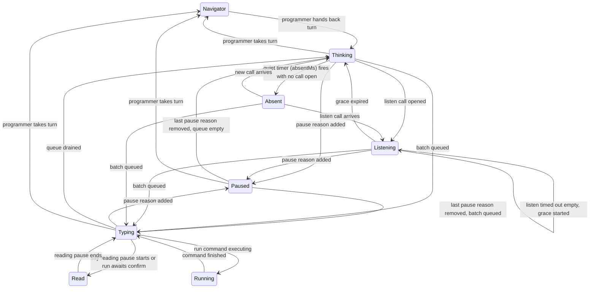
```mermaid
stateDiagram-v2
  state "Navigator" as navigator
  state "Paused" as paused
  state "Typing" as typing
  state "Read" as read
  state "Running" as running
  state "Listening" as listening
  state "Thinking" as thinking
  state "Absent" as absent
  thinking --> navigator: programmer takes turn
  navigator --> thinking: programmer hands back turn
  thinking --> paused: pause reason added
  typing --> paused: pause reason added
  listening --> paused: pause reason added
  paused --> thinking: last pause reason removed, queue empty
  paused --> typing: last pause reason removed, batch queued
  thinking --> typing: batch queued
  listening --> typing: batch queued
  absent --> typing: batch queued
  typing --> read: say reading pause starts or run awaits confirm
  read --> typing: reading pause ends
  typing --> running: run command executing
  running --> typing: command finished
  typing --> thinking: queue drained
  thinking --> listening: listen call opened
  listening --> listening: listen timed out empty, grace started
  listening --> thinking: grace expired
  thinking --> absent: quiet timer (absentMs) fires with no call open
  absent --> thinking: new call arrives
  absent --> listening: listen call arrives
  typing --> navigator: programmer takes turn
  paused --> navigator: programmer takes turn
```

## Run Command Confirmation

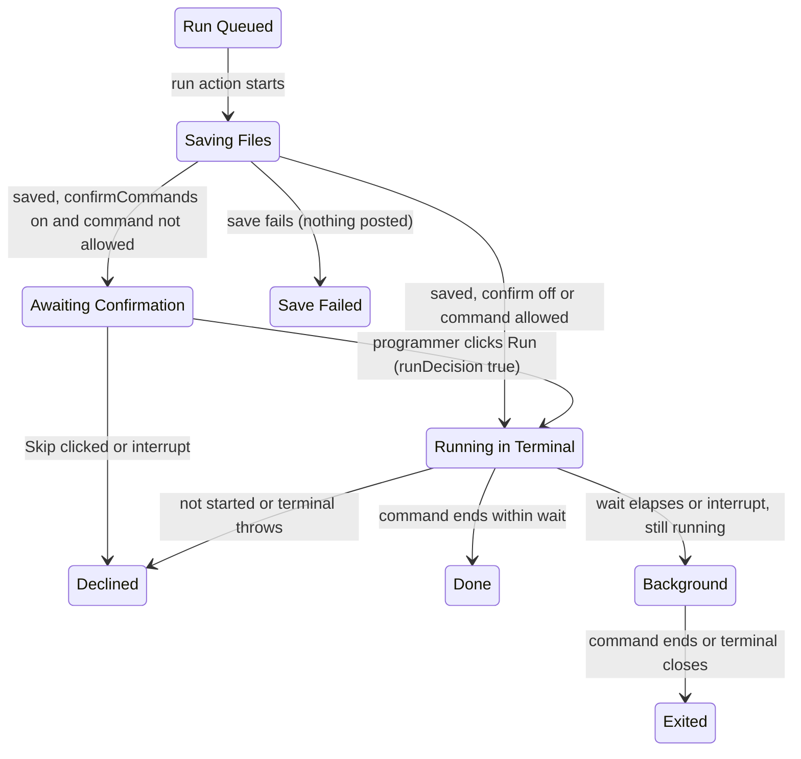
```mermaid
stateDiagram-v2
  state "Run Queued" as queued
  state "Saving Files" as saving
  state "Awaiting Confirmation" as confirming
  state "Declined" as declined
  state "Running in Terminal" as running
  state "Done" as done
  state "Background" as background
  state "Exited" as exited
  state "Save Failed" as saveFailed
  queued --> saving: run action starts
  saving --> saveFailed: save fails (nothing posted)
  saving --> confirming: saved, confirmCommands on and command not allowed
  saving --> running: saved, confirm off or command allowed
  confirming --> running: programmer clicks Run (runDecision true)
  confirming --> declined: Skip clicked or interrupt
  running --> declined: not started or terminal throws
  running --> done: command ends within wait
  running --> background: wait elapses or interrupt, still running
  background --> exited: command ends or terminal closes
```

## Reading Speed Calibration 2

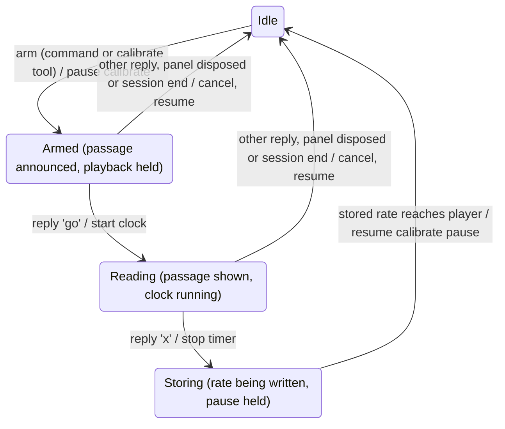
```mermaid
stateDiagram-v2
  state "Idle" as idle
  state "Armed (passage announced, playback held)" as armed
  state "Reading (passage shown, clock running)" as reading
  state "Storing (rate being written, pause held)" as storing
  idle --> armed: arm (command or calibrate tool) / pause calibrate
  armed --> reading: reply 'go' / start clock
  reading --> storing: reply 'x' / stop timer
  storing --> idle: stored rate reaches player / resume calibrate pause
  armed --> idle: other reply, panel disposed or session end / cancel, resume
  reading --> idle: other reply, panel disposed or session end / cancel, resume
```

## Relay Editor Connection

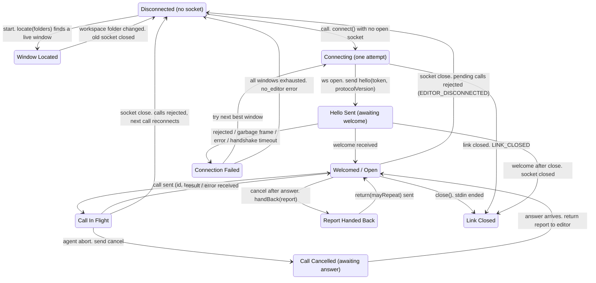
```mermaid
stateDiagram-v2
  state "Disconnected (no socket)" as idle
  state "Window Located" as located
  state "Connecting (one attempt)" as connecting
  state "Hello Sent (awaiting welcome)" as handshaking
  state "Welcomed / Open" as ready
  state "Call In Flight" as calling
  state "Call Cancelled (awaiting answer)" as cancelling
  state "Report Handed Back" as handedback
  state "Connection Failed" as failed
  state "Link Closed" as closed
  idle --> located: start. locate(folders) finds a live window
  located --> idle: workspace folder changed. old socket closed
  idle --> connecting: call. connect() with no open socket
  connecting --> handshaking: ws open. send hello(token, protocolVersion)
  handshaking --> ready: welcome received
  handshaking --> failed: rejected / garbage frame / error / handshake timeout
  failed --> connecting: try next best window
  failed --> idle: all windows exhausted. no_editor error
  ready --> calling: call sent (id, tool, args)
  calling --> ready: result / error received
  calling --> cancelling: agent abort. send cancel
  cancelling --> ready: answer arrives. return report to editor
  ready --> handedback: cancel after answer. handBack(report)
  handedback --> ready: return(mayRepeat) sent
  ready --> idle: socket close. pending calls rejected (EDITOR_DISCONNECTED)
  calling --> idle: socket close. calls rejected, next call reconnects
  ready --> closed: close(). stdin ended
  connecting --> closed: link closed. LINK_CLOSED
  handshaking --> closed: welcome after close. socket closed
```

## Session Start and Discovery

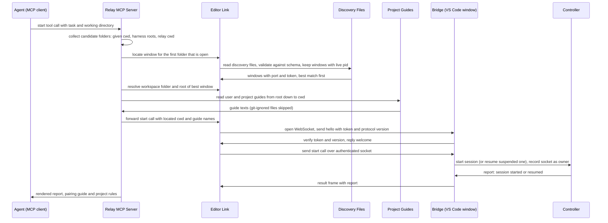
```mermaid
sequenceDiagram
  participant agent as Agent (MCP client)
  participant server as Relay MCP Server
  participant n_link as Editor Link
  participant disc as Discovery Files
  participant guides as Project Guides
  participant bridge as Bridge (VS Code window)
  participant ctrl as Controller
  agent->>server: start tool call with task and working directory
  server->>server: collect candidate folders: given cwd, harness roots, relay cwd
  server->>n_link: locate window for the first folder that is open
  n_link->>disc: read discovery files, validate against schema, keep windows with live pid
  disc->>n_link: windows with port and token, best match first
  server->>n_link: resolve workspace folder and root of best window
  server->>guides: read user and project guides from root down to cwd
  guides->>server: guide texts (git-ignored files skipped)
  server->>n_link: forward start call with located cwd and guide names
  n_link->>bridge: open WebSocket, send hello with token and protocol version
  bridge->>n_link: verify token and version, reply welcome
  n_link->>bridge: send start call over authenticated socket
  bridge->>ctrl: start session (or resume suspended one), record socket as owner
  ctrl->>bridge: report: session started or resumed
  bridge->>n_link: result frame with report
  server->>agent: rendered report, pairing guide and project rules
```

## Batch Rehearsal and Playback 2

```mermaid
sequenceDiagram
  participant agent as Agent (MCP client)
  participant relay as Relay MCP Server
  participant bridge as Editor Bridge
  participant ctrl as Controller (batch queue)
  participant rehearsal as Rehearsal (in-memory)
  participant player as Player
  participant editor as VS Code Editor
  participant panel as Narration Panel
  agent->>relay: step with a batch of actions
  relay->>bridge: forward call over WebSocket
  bridge->>ctrl: submit batch
  ctrl->>rehearsal: rehearse batch from where queued batches leave off
  rehearsal->>player: play instantly and silently on a memory copy of the editor
  rehearsal->>ctrl: result, or the failing action
  ctrl->>ctrl: queue batch (or reject it if rehearsal failed)
  ctrl->>player: play head batch of the queue
  player->>editor: move cursor, type chunks at human pace, select, point
  player->>panel: post say text and reading pause
  player->>editor: save edited files
  player->>ctrl: batch result with resulting code
  ctrl->>bridge: report of the previous batch once it has finished
  bridge->>relay: result frame
  relay->>agent: step result rendered as text
```

## Programmer Interruption and Listen

```mermaid
sequenceDiagram
  participant programmer as Programmer
  participant panel as Narration Panel
  participant editor as VS Code Editor Adapter
  participant controller as Session Controller
  participant timeline as Playback Timeline
  participant bridge as Bridge
  participant relay as Relay (MCP server)
  participant agent as Agent
  agent->>relay: listen: wait for the programmer
  relay->>bridge: forward listen call over WebSocket
  bridge->>controller: listen blocks until news or timeout
  programmer->>panel: sends a message, interrupt, pause, or turn change
  panel->>controller: reply, interrupt, pause or turn change
  programmer->>editor: edits a file or looks away
  editor->>controller: reports the programmer's edit, or pauses when they look away
  controller->>controller: record event, discard queued batches, mark session stale
  controller->>timeline: interrupt playback (or hold it on pause)
  controller->>controller: wake the blocked listen if the event interrupts
  controller->>bridge: report with events and discarded batches
  bridge->>relay: send result back over WebSocket
  relay->>agent: render report as text (what the programmer did)
```

## Run Command with Confirmation

```mermaid
sequenceDiagram
  participant agent as Agent (via Relay)
  participant bridge as Editor Bridge
  participant ctrl as Controller
  participant player as Player
  participant panel as Narration Panel
  participant editor as VS Code Editor
  participant term as Pair Terminals
  agent->>bridge: step call with a batch ending in a run action
  bridge->>ctrl: forward step
  ctrl->>player: play queued batch
  player->>editor: save files edited by the batch
  player->>panel: post run event awaiting confirmation
  panel->>ctrl: programmer clicks Run (or Allow for session)
  ctrl->>player: decision releases the waiting confirm
  player->>panel: post run event: running
  player->>editor: run command with working directory, wait limit, abort signal
  editor->>term: run in shell-integrated terminal
  term->>editor: tail of output, shell, exit code
  editor->>player: command outcome
  player->>panel: post run event: done with exit code
  player->>ctrl: batch result with run output and exit code
  ctrl->>bridge: report for the next call
  bridge->>agent: result, relay renders output and exit code as text
```

## Cancel and Report Hand-Back

```mermaid
sequenceDiagram
  participant agent as Agent Harness (MCP client)
  participant server as Relay MCP Server
  participant n_link as Relay Editor Link
  participant proto as Wire Protocol
  participant bridge as Editor Bridge
  participant ctrl as Controller
  server->>n_link: forward tool call with abort signal
  n_link->>bridge: send call over WebSocket
  bridge->>ctrl: dispatch call, abort signal tied to the socket call
  agent->>server: cancel notification for the request
  n_link->>bridge: cancelled call: forward cancel to editor
  bridge->>n_link: report answer arrives for the cancelled call
  n_link->>proto: frame 'return' message carrying the report
  n_link->>bridge: send return: report never reached the agent
  server->>server: cancel after answer: look up the report kept for that request
  server->>n_link: hand back the answered report
  n_link->>proto: frame 'return' marked as possibly repeated
  n_link->>bridge: send return over the socket the report came on
  bridge->>proto: parse and validate the return message
  bridge->>ctrl: restore report, only if sender owns the session
  ctrl->>ctrl: put batches and events back, flag next report as repeated
```

## Reload Suspend and Resume

```mermaid
sequenceDiagram
  participant agent as Agent via Relay
  participant bridge as Editor Bridge
  participant ctrl as Session Controller
  participant panel as Narration Panel
  participant ext as Extension Window
  participant store as Workspace Storage
  agent->>bridge: socket closes (agent gone or window reloading)
  bridge->>ctrl: owner socket closed: disconnect
  ctrl->>ctrl: discard queued batches, mark session suspended
  ctrl->>panel: post session event (active, suspended)
  panel->>ext: notify after each post
  ext->>store: after short delay, save session and panel history, save once more on window dispose
  ext->>store: after reload: read saved session and history
  ext->>panel: restore panel history
  ext->>ctrl: revive saved session as suspended
  ctrl->>panel: replayed session event shows live but suspended
  agent->>bridge: reconnect and call start again from same directory
  bridge->>ctrl: start request
  ctrl->>ctrl: same root: clear suspended, reset what agent has seen
  ctrl->>panel: post session event (resumed)
  ctrl->>bridge: resumed report with turn, cursor and history
  bridge->>agent: report: session has resumed
```

## Class

```mermaid
classDiagram
  class controller {
    + start(task, root, rules): Promise<Report>
    + step(actions, signal): Promise<Report>
    + listen(signal): Promise<Report>
    + end(summary, signal): Promise<Report>
    + read(file, from, to): Promise<FileContent>
    + userEdit(file, before, after, changes): void
    + pause(reason): void
    + resume(reason): void
  }
  class player {
    + scene: Scene
    + reading: boolean
    + play(id, actions): Promise<BatchResult>
    + codeAt(cursor, span): Promise<Code>
    + transform(file, change): void
  }
  class rehearsal {
    + rehearse(editor, config, from, actions, knows): Promise<Result>
    + followChange(r, file, after, changes): void
  }
  class memoryeditor {
    + texts: Map<string,string>
    + edits: Set<string>
    + getText(file): Promise<string>
    + edit(file, offset, deleteLength, text): Promise<void>
  }
  class timeline {
    + isInterrupted: boolean
    + signal: AbortSignal
    + sleep(ms): Promise<boolean>
    + pause(): void
    + resume(): void
    + interrupt(): void
    + reset(): void
  }
  class lineids {
    + editor(): LineIds
    + of(file, text): number[]
    + apply(file, change): void
    + fork(): LineIds
    + adopt(played): void
  }
  class config {
    + maxBlockMs: number
    + timing: Timing
    + confirmCommands: boolean
    + runWaitMs: number
  }
  class editorport {
    + resolvePath(file): string
    + getText(file): Promise<string>
    + show(file): Promise<void>
    + edit(...): Promise<void>
    + save(file): Promise<void>
    + renderCursor(...): void
    + runCommand(cmd, options): Promise<CommandOutcome>
  }
  class panelport {
    + post(event: PanelEvent): void
  }
  class bridge {
    - server: WebSocketServer
    - token: string
    + start(): Promise<void>
    + writeDiscovery(): void
    + focused(): void
    + dispose(): void
  }
  class vseditor {
    + onSelection: function
    + wrote: function
    + show(file): Promise<void>
    + edit(...): Promise<void>
    + renderCursor(...): void
    + programmerSelection(): SharedSelection
  }
  class terminals {
    - owned: Owned[]
    + run(command, options): Promise<CommandOutcome>
    + dispose(): void
  }
  class panel {
    + viewId: string
    + history: PanelEvent[]
    + post(event): void
    + resolveWebviewView(view): void
    + askStart(): void
    + showCalibration(view): void
  }
  class calibration {
    + phase: Phase
    + arm(passage): boolean
    + reply(text): boolean
    + cancel(): void
  }
  class outside {
    + saved(file, text): void
    + reported(file): void
    + seen(file, text): void
    + isMarked(file): boolean
  }
  class setup {
    + writeLauncher(extensionPath): string
    + setUpAgent(launcher, host): Promise<void>
    + claudeStarter(launcher): Starter
  }
  class extension {
    + activate(context): Api
    + deactivate(): void
  }
  class editorlink {
    + locate(folders): string
    + workspace(folder): object
    + call(tool, args, signal): Promise<unknown>
    + handBack(report): void
    + close(): void
  }
  class relayserver {
    + createServer(link, guide, cwd): McpServer
    + serve(options): Promise<void>
  }
  class protocol {
    + ACTION_SCHEMA
    + REPORT_SCHEMA
    + parseRelayMessage(data): RelayMessage
    + parseEditorMessage(data): EditorMessage
    + fieldsProblem(action): string
    + withinFolder(folder, file): string
  }
  class toolerror {
    + code: ToolErrorCode
  }
  class relayerror {
    + code: string
  }
  class missingfile {
    + file: string
  }
  class places {
    + resolveSpot(text, spot): Resolution
    + resolveSpan(text, span): Resolution
    + planTyping(...): Chunk[]
    + boundedDiff(...): object
  }
  controller o-- editorport
  controller o-- panelport
  controller *-- player
  controller *-- timeline
  controller *-- lineids
  controller --> config : tuned by 1
  controller ..> rehearsal
  controller ..> toolerror
  player ..> editorport
  player --> timeline : paced by 1
  player ..> places
  player --> lineids : tracks lines 1
  rehearsal ..> player
  rehearsal *-- memoryeditor
  memoryeditor ..> editorport
  memoryeditor ..> missingfile
  bridge o-- controller
  bridge ..> protocol
  editorport <|.. vseditor
  vseditor *-- terminals
  vseditor --> controller : calls back 1
  panelport <|.. panel
  panel --> controller : drives 1
  panel --> calibration : routes replies to 1
  calibration ..> panel
  outside ..> vseditor
  extension *-- controller
  extension *-- vseditor
  extension *-- panel
  extension *-- bridge
  extension *-- calibration
  extension *-- outside
  extension ..> setup
  relayserver *-- editorlink
  relayserver ..> protocol
  editorlink ..> protocol
  editorlink ..> relayerror
  relayerror ..> relayerror
  editorlink --> bridge : talks to over WebSocket 0..*
  controller ..> protocol
```

## ER

```mermaid
erDiagram
  action {
    String say
    MoveTarget move
    SpanTarget select
    String type
    String type_fast
    true delete
    SpanTarget point
    String run
    float wait
  }
  movetarget {
    String file
    int line
    String at
    'line_end' to
  }
  spantarget {
    String file
    int line
    String text
    String from
    String through
  }
  batch {
    int id
    BatchStatus status
    Code code
    BatchError error
    Action[] unplayed
    RunResult[] runs
    {file, error}[] unsaved
  }
  batcherror {
    ErrorKind kind
    String message
    Candidate[] candidates
  }
  candidate {
    int line
    String context
  }
  runresult {
    String command
    int exit_code
    String output
    bool truncated
    bool running
    String shell
  }
  code {
    String file
    {number, text}[] lines
    {final_newline} end
  }
  filecontent {
    String file
    bool dirty
    {number, text}[] lines
    {final_newline} end
  }
  report {
    BatchResult[] batches
    {id, status} submitted
    {index, action, error, code} rejected
    Event[] events
    Turn turn
    Code cursor
    bool waiting
    bool repeated
    bool resumed
    PauseReason[] paused
  }
  event {
    message|edit|interrupt|turn|end kind
    String text
    String file
    String diff
    programmer|other by
    int omitted
    Turn to
    String message
  }
  excerpt {
    String file
    LineColumn from
    LineColumn to
    String text
    bool truncated
  }
  linecol {
    int line
    int column
  }
  passage {
    String title
    String text
    String notice
  }
  discovery {
    int pid
    String[] workspaceFolders
    int port
    String token
    int protocolVersion
    int lastFocused
  }
  relaymsg {
    hello|call|cancel|return type
    unknown token
    unknown protocolVersion
    int id
    String tool
    Record args
    Report report
    bool mayRepeat
  }
  editormsg {
    welcome|rejected|result|error type
    String reason
    int id
    unknown result
    ToolErrorCode|internal code
    String message
  }
  savedsession {
    String task
    Scene subset scene
    BatchResult[] finished
    Event[] events
  }
  scene {
    String root
    Turn turn
    {file, offset} cursor
    {start, end} selection
    String[] allowedCommands
  }
  config {
    int maxBlockMs
    int navigatorIdleMs
    int listenGraceMs
    int absentMs
    Timing timing
    bool confirmCommands
    int runWaitMs
    int maxRunWaitMs
  }
  timing {
    Cadence type
    float fastFactor
    Reading reading
    int beforeMoveMs
    int afterMoveNearMs
    int afterMoveFarMs
    int nearLines
    int glideMs
    int glidePerLineMs
    int glideMaxMs
  }
  cadence {
    int charMs
    float jitter
    int wordStartMs
    int punctuationMs
    int openBracketMs
    int newlineMs
  }
  reading {
    float msPerChar
    int minMs
  }
  panelevent {
    session|say|reading|state|programmer|turn|interrupt|point|outside|run type
    String text
    AgentState state
    Ref ref
    int id
    String command
    String phase
  }
  ref {
    String file
    int line
    int endLine
  }
  timings {
    int saveMs
    int groupMs
    int selfNavMs
    int pulseMs
    int shellIntegrationMs
    int drainMs
    int tipDelayMs
  }
  agent {
    String id
    String label
  }
  action ||--o{ movetarget : "moves to"
  action ||--o{ spantarget : "selects/points at"
  batch ||--o{ action : "leaves unplayed"
  batch ||--o{ code : "produces"
  batch ||--o{ batcherror : "fails with"
  batch ||--o{ runresult : "runs"
  batcherror ||--o{ candidate : "offers"
  report ||--o{ batch : "contains"
  report ||--o{ event : "contains"
  report ||--o{ code : "shows cursor in"
  report ||--o{ action : "rejects"
  event ||--o{ excerpt : "carries selection"
  excerpt ||--o{ linecol : "spans"
  relaymsg ||--o{ report : "hands back"
  editormsg ||--o{ report : "answers with"
  editormsg ||--o{ filecontent : "answers with"
  savedsession ||--o{ scene : "stores"
  savedsession ||--o{ batch : "keeps finished"
  savedsession ||--o{ event : "keeps pending"
  config ||--o{ timing : "uses"
  timing ||--o{ cadence : "types with"
  timing ||--o{ reading : "reads with"
  panelevent ||--o{ ref : "links via"
```

## Concurrency

```mermaid
%%{init: {"flowchart": {"curve": "basis"}}}%%
flowchart LR
  subgraph rloop_grp["Relay Event Loop"]
    mcp["MCP Tool Handlers
forward calls, track cancels (coroutine)"]
    n_link["Editor Link
WebSocket client, call matching (coroutine)"]
  end
  subgraph eloop_grp["Extension Host Loop"]
    bridge["Bridge
WebSocket server, dispatch (coroutine)"]
    ctrl["Controller
serialised calls, session state (coroutine)"]
    player["Player
plays batches at human pace (coroutine)"]
    editor["VS Code Editor and Terminals
edits, cursor, shell runs (coroutine)"]
  end
  agent["Agent Harness
external MCP client (process)"]
  relay["Relay Process
pair-mcp over stdio (process)"]
  rloop["Relay Event Loop
single-threaded Node (loop)"]
  ws["Localhost WebSocket
frames, discovery file, token (resource)"]
  eloop["Extension Host Loop
single-threaded Node (loop)"]
  queue["Batch Queue
queued batches and events (resource)"]
  timeline["Timeline
pausable, interruptible sleeps (sync)"]
  agent -->|"spawns"| relay
  relay -->|"spawns"| rloop
  rloop -->|"spawns"| mcp
  mcp -->|"awaits"| n_link
  n_link -->|"writes (cross-boundary)"| ws
  bridge -->|"consumes from (cross-boundary)"| ws
  eloop -->|"spawns"| bridge
  bridge -->|"awaits"| ctrl
  ctrl -->|"puts to"| queue
  ctrl -->|"spawns"| player
  player -->|"consumes from"| queue
  player -->|"awaits"| timeline
  ctrl -->|"signals"| timeline
  player -->|"awaits"| editor
  editor -->|"signals"| ctrl
```

## VS Code integration

```mermaid
%%{init: {"flowchart": {"curve": "basis"}}}%%
flowchart LR
  subgraph ext["AI Pair extension (packages/vscode)"]
    ctrl["Session controller
AI Pair core"]
    editorts["Editor adapter
VsEditor"]
    termts["Terminal runner"]
    panelts["Pair panel host"]
    outsidets["Outside-change watcher"]
    extts["Activation and wiring"]
  end
  subgraph host["Extension host: vscode API"]
    api["vscode API surface
extHost.api.impl"]
    exttext["ExtHostTextEditor(s)
decorations, reveal, edit"]
    extdoc["ExtHostDocuments
workspace.applyEdit"]
    extterm["ExtHostTerminalService
Shell integration"]
    extweb["ExtHostWebviewViews"]
    extfs["ExtHostFileSystemEventService
File decorations"]
    extcmd["ExtHostCommands
setContext"]
  end
  subgraph seam["Process boundary"]
    rpc["RPCProtocol
Proxy identifiers"]
  end
  subgraph ui["Workbench renderer (UI)"]
    mtedit["MainThreadTextEditors
MainThreadDocuments"]
    mtterm["MainThreadTerminalService
ShellIntegration"]
    mtweb["MainThreadWebviewViews
secondary sidebar"]
    mtfs["MainThreadFileSystemEventService
MainThreadDecorations"]
    mtcmd["MainThreadCommands
context keys"]
  end
  extts -->|"builds session"| ctrl
  ctrl -->|"EditorPort"| editorts
  ctrl -->|"run command"| termts
  ctrl -->|"PanelPort"| panelts
  extts -->|"starts"| outsidets
  editorts -->|"vscode.window / workspace"| api
  termts -->|"createTerminal, shellIntegration"| api
  panelts -->|"registerWebviewViewProvider"| api
  outsidets -->|"watcher, decorations"| api
  extts -->|"registerCommand, config"| api
  api -->|"editors"| exttext
  api -->|"documents"| extdoc
  api -->|"terminals"| extterm
  api -->|"views"| extweb
  api -->|"files"| extfs
  api -->|"commands"| extcmd
  exttext -->|"$try* calls"| rpc
  extdoc -->|"edits"| rpc
  extterm -->|"terminal events"| rpc
  extweb -->|"webview messages"| rpc
  extfs -->|"watch"| rpc
  extcmd -->|"commands"| rpc
  rpc -->|"proxy"| mtedit
  rpc -->|"proxy"| mtterm
  rpc -->|"proxy"| mtweb
  rpc -->|"proxy"| mtfs
  rpc -->|"proxy"| mtcmd
```

## Editor round trip

```mermaid
sequenceDiagram
  participant prog as Programmer
  participant ext as AI Pair extension
  participant api as vscode API (ext host)
  participant rpc as RPC seam
  participant ui as Workbench renderer
  ext->>api: setDecorations / revealRange
  api->>rpc: $try* proxy call
  rpc->>ui: render cursor in editor
  prog->>ui: types or scrolls
  ui->>rpc: document / visible-range event
  rpc->>api: onDidChange*
  api->>ext: interrupt or stale batch
```
